# MovieMatch

## Aplicación de recomendaciones de películas

**Primer entregable**

Asignatura: Calidad de Software 2025-2 
Profesor: Albeiro Espinosa Bedoya, Ph.D., M.Sc.

Estudiante: Mariana Agudelo Ospina (Equipo 1)

## Contenido del entregable

1. Introducción
2. Modelo de dominio
3. Diagrama de casos de uso
4. Especificación de casos de uso
5. Mockups (prototipos de interfaz)

## 1. Introducción

MovieMatch es una aplicación que recomienda películas y series combinando los
gustos del usuario con las valoraciones de sus amigos, de modo que la elección
de qué ver deje de ser una tarea tediosa y se convierta en algo más social.

Este primer entregable reúne el análisis y el diseño inicial del sistema. Para
ello partimos del modelo de dominio, que fija el vocabulario del negocio;
seguimos con el diagrama de casos de uso, que delimita qué hace el sistema y
quién lo usa; luego detallamos cada caso de uso siguiendo una plantilla basada
en RUP; y, por último, presentamos los prototipos de las pantallas principales.

## 2. Modelo de dominio

El modelo de dominio recoge los conceptos del negocio de MovieMatch, sus
atributos y las relaciones entre ellos, sin entrar todavía en detalles de
implementación. Sirve como lenguaje común para el resto del trabajo.

### 2.1 Entidades

| Entidad | Descripción | Atributos clave |
|---|---|---|
| Usuario (User) | Persona registrada en la plataforma. | nombre completo (fullName), correo electrónico (email), contraseña cifrada (passwordHash), fecha de registro (registeredAt), estado (status) |
| Administrador (Administrator) | Especialización del usuario con permisos de gestión. | nivel de acceso (accessLevel) |
| Perfil (Profile) | Datos de personalización del usuario (relación 1 a 1). | alias (alias), URL del avatar (avatarUrl), biografía (bio) |
| Género (Genre) | Categoría de clasificación del contenido. | nombre (name) |
| Preferencia (Preference) | Asociación entre perfil y género con un peso de interés. | nivel de interés (interestLevel) |
| Contenido audiovisual (AudiovisualContent) | Abstracción de una obra audiovisual. | título (title), sinopsis (synopsis), año de estreno (releaseYear), URL del póster (posterUrl), clasificación (contentRating) |
| Película / Serie (Movie / Series) | Especializaciones del contenido. | duración en minutos (durationMin) / número de temporadas (seasonCount), número de episodios (episodeCount) |
| Valoración (Rating) | Calificación que un usuario da a un contenido. | puntuación de 1 a 5 (score), comentario (comment), fecha (date) |
| Lista de recomendaciones (RecommendationList) | Colección curada y compartible de contenidos. | nombre (name), descripción (description), es pública (isPublic) |
| Amistad (Friendship) | Relación social entre dos usuarios. | estado (status), fecha de solicitud (requestedAt), fecha de aceptación (acceptedAt) |
| Motor de recomendaciones (RecommendationEngine) | Servicio de inteligencia artificial. | versión (version), algoritmo (algorithm) |
| Recomendación (Recommendation) | Sugerencia generada para un usuario. | puntuación (score), motivo (reason), fecha de generación (generatedAt) |
| Métrica de uso (UsageMetric) | Indicador agregado para el panel de administración. | tipo (type), valor (value), fecha de corte (cutoffDate) |

### 2.2 Reglas de dominio

Las principales reglas que rigen el dominio son las siguientes:

- RN-D1: el correo electrónico es único por usuario.
- RN-D2: la puntuación de una valoración está entre 1 y 5.
- RN-D3: un usuario solo puede tener una valoración vigente por contenido.
- RN-D4: solo las amistades en estado aceptado (ACCEPTED) influyen en las recomendaciones.
- RN-D5: toda recomendación la genera el motor de recomendaciones, nunca se crea de forma manual.

El modelo usa tres enumeraciones. El estado del usuario (UserStatus) puede ser
activo, inactivo o suspendido (ACTIVE, INACTIVE, SUSPENDED). El estado de la
amistad (FriendshipStatus) puede ser pendiente, aceptada, rechazada o bloqueada
(PENDING, ACCEPTED, REJECTED, BLOCKED). El nivel de acceso (AccessLevel)
puede ser moderador o superadministrador (MODERATOR, SUPERADMIN).

## 3. Diagrama de casos de uso

El diagrama de casos de uso muestra el alcance funcional del sistema: los
actores que interactúan con MovieMatch y los objetivos que persiguen.

### 3.1 Actores

El **usuario** es el actor principal: valora contenido, recibe recomendaciones e
interactúa con su círculo social. Un amigo no es más que otro usuario vinculado
por una amistad aceptada. El **administrador** es una especialización del
usuario y se encarga de la gestión de usuarios, contenido y métricas, por lo que
hereda también los casos de uso del usuario. Por último, el **motor de
recomendaciones** es un actor de sistema: el servicio de inteligencia artificial
que se invoca para producir las sugerencias.

### 3.2 Inventario de casos de uso

| ID | Caso de uso | Actor |
|---|---|---|
| CU-01 | Registrarse | Usuario |
| CU-02 | Iniciar sesión | Usuario |
| CU-03 | Gestionar perfil y preferencias | Usuario |
| CU-04 | Valorar película o serie | Usuario |
| CU-05 | Recibir recomendaciones personalizadas | Usuario |
| CU-06 | Buscar o explorar el catálogo | Usuario |
| CU-07 | Gestionar solicitudes de amistad | Usuario |
| CU-08 | Compartir lista de recomendaciones | Usuario |
| CU-09 | Ver valoraciones de amigos | Usuario |
| CU-10 | Gestionar usuarios | Administrador |
| CU-11 | Gestionar contenido | Administrador |
| CU-12 | Consultar métricas de uso | Administrador |

### 3.3 Relaciones

Entre el administrador y el usuario existe una generalización, ya que el primero
puede ejecutar también los casos de uso del segundo. Los casos que requieren una
sesión activa incluyen a CU-02 (Iniciar sesión), y CU-05 incluye al motor de
recomendaciones. Como relaciones de extensión, CU-08 y CU-09 extienden a CU-05,
porque desde la pantalla de recomendaciones se puede compartir una lista o ver
las valoraciones de amigos, y CU-04 extiende a CU-06, porque desde el catálogo
se puede valorar un contenido.

## 4. Especificación de casos de uso

A continuación se detalla cada caso de uso. Para cada uno se indican el objetivo,
los actores, el disparador, las precondiciones, el flujo principal, los flujos
alternativos y de excepción, las postcondiciones, las reglas de negocio y la
prioridad. Las abreviaturas usadas son FA (flujo alternativo), FE (flujo de
excepción) y RN (regla de negocio).

### CU-01. Registrarse

**Objetivo.** Permitir que una persona cree una cuenta para acceder a las
funcionalidades de la plataforma.
**Actor principal.** Usuario (visitante no registrado).
**Disparador.** El visitante selecciona "Crear cuenta".
**Precondiciones.** El visitante no tiene sesión activa y dispone de un correo válido.

**Flujo principal.**
1. El sistema muestra el formulario de registro (nombre, correo, contraseña y confirmación).
2. El usuario completa los campos y acepta los términos y la política de tratamiento de datos.
3. El usuario confirma el registro.
4. El sistema valida el formato y la unicidad del correo.
5. El sistema cifra la contraseña, crea el usuario en estado activo (ACTIVE) y le asocia un perfil vacío.
6. El sistema envía un correo de verificación y muestra la confirmación.

**Flujos alternativos.**
- FA-01: en el paso 2 el usuario elige registrarse con una red social; el sistema obtiene los datos del proveedor y continúa en el paso 5.

**Flujos de excepción.**
- FE-01: el correo ya está registrado; el sistema lo informa y sugiere iniciar sesión.
- FE-02: las contraseñas no coinciden o no cumplen la política; el sistema marca el error y no crea la cuenta.
- FE-03: falla el servicio de correo; la cuenta se crea y se avisa que la verificación se reenviará.

**Postcondiciones.** Existe un nuevo usuario con su perfil asociado.
**Reglas de negocio.** RN-01: el correo es único. RN-02: la contraseña debe tener al menos 8 caracteres, una mayúscula y un número.
**Prioridad.** Alta. **Frecuencia de uso.** Media.

### CU-02. Iniciar sesión

**Objetivo.** Autenticar a un usuario registrado para darle acceso a sus funcionalidades.
**Actor principal.** Usuario.
**Disparador.** El usuario selecciona "Iniciar sesión".
**Precondiciones.** El usuario tiene una cuenta activa.

**Flujo principal.**
1. El sistema muestra el formulario de inicio de sesión (correo y contraseña).
2. El usuario ingresa sus credenciales y confirma.
3. El sistema valida las credenciales.
4. El sistema crea la sesión y redirige al inicio con recomendaciones.

**Flujos alternativos.**
- FA-01: el usuario inicia sesión con una red social mediante OAuth y continúa en el paso 4.
- FA-02: el usuario elige "¿Olvidaste tu contraseña?" y el sistema envía un enlace de restablecimiento.

**Flujos de excepción.**
- FE-01: credenciales inválidas; el sistema lo informa sin revelar cuál campo falló.
- FE-02: cuenta suspendida o inactiva; el sistema deniega el acceso e indica el motivo.
- FE-03: tras varios intentos fallidos, el sistema aplica un bloqueo temporal.

**Postcondiciones.** El usuario queda con una sesión activa.
**Reglas de negocio.** RN-03: tras 5 intentos fallidos se bloquea el acceso por 15 minutos.
**Prioridad.** Alta. **Frecuencia de uso.** Alta.

### CU-03. Gestionar perfil y preferencias

**Objetivo.** Permitir al usuario editar sus datos de perfil y sus preferencias de géneros para afinar las recomendaciones.
**Actor principal.** Usuario.
**Disparador.** El usuario abre la sección "Mi perfil".
**Precondiciones.** Sesión activa.

**Flujo principal.**
1. El sistema muestra los datos del perfil y las preferencias actuales.
2. El usuario edita su alias, avatar, biografía o selecciona géneros de interés.
3. El usuario guarda los cambios.
4. El sistema valida y persiste el perfil y las preferencias.
5. El sistema confirma y marca las recomendaciones para recálculo.

**Flujos alternativos.**
- FA-01: el usuario sube un avatar; el sistema valida formato y tamaño y lo almacena.
- FA-02: el usuario solicita eliminar su cuenta; el sistema inicia el proceso de baja y anonimización.

**Flujos de excepción.**
- FE-01: el archivo de avatar no es válido; el sistema lo rechaza.
- FE-02: falla la persistencia; el sistema conserva los datos previos e informa el error.

**Postcondiciones.** El perfil y las preferencias quedan actualizados.
**Reglas de negocio.** RN-04: las preferencias influyen en el peso del algoritmo de recomendación.
**Prioridad.** Alta. **Frecuencia de uso.** Media.

### CU-04. Valorar película o serie

**Objetivo.** Permitir al usuario calificar un contenido para enriquecer su historial y mejorar las recomendaciones.
**Actor principal.** Usuario.
**Disparador.** El usuario selecciona "Valorar" en la ficha de un contenido.
**Precondiciones.** Sesión activa y el contenido existe en el catálogo.

**Flujo principal.**
1. El sistema muestra la ficha del contenido y el control de valoración de 1 a 5 con comentario opcional.
2. El usuario asigna una puntuación y, si quiere, un comentario.
3. El usuario confirma.
4. El sistema valida el rango y registra o actualiza la valoración.
5. El sistema confirma y marca las recomendaciones para recálculo.

**Flujos alternativos.**
- FA-01: el usuario edita una valoración previa; el sistema actualiza la existente.
- FA-02: el usuario elimina su valoración; el sistema la retira del historial.

**Flujos de excepción.**
- FE-01: la puntuación está fuera de rango; el sistema la rechaza y pide un valor de 1 a 5.
- FE-02: el contenido fue retirado del catálogo; el sistema impide valorar e informa.

**Postcondiciones.** El historial de valoraciones del usuario queda actualizado.
**Reglas de negocio.** RN-05: la puntuación va de 1 a 5. RN-06: una sola valoración vigente por usuario y contenido.
**Prioridad.** Alta. **Frecuencia de uso.** Alta.

### CU-05. Recibir recomendaciones personalizadas

**Objetivo.** Ofrecer al usuario una lista de contenidos sugeridos a partir de su historial y de las valoraciones de sus amigos.
**Actor principal.** Usuario. **Actor secundario.** Motor de recomendaciones.
**Disparador.** El usuario accede al inicio o solicita actualizar las recomendaciones.
**Precondiciones.** Sesión activa y existe historial de valoraciones o preferencias.

**Flujo principal.**
1. El usuario accede al inicio.
2. El sistema solicita sugerencias al motor de recomendaciones.
3. El motor analiza el historial, las preferencias y las valoraciones de los amigos aceptados.
4. El motor devuelve un conjunto ordenado de recomendaciones con su puntuación y su motivo.
5. El sistema muestra las recomendaciones en menos de 2 segundos.

**Flujos alternativos.**
- FA-01: usuario nuevo sin historial; el motor recomienda por popularidad y por los géneros declarados.
- FA-02: el usuario filtra las recomendaciones por género o por lo que ven sus amigos.

**Flujos de excepción.**
- FE-01: el motor no responde a tiempo; el sistema muestra recomendaciones en caché o populares y registra el incidente.
- FE-02: no hay datos suficientes; el sistema invita al usuario a valorar contenido o definir preferencias.

**Postcondiciones.** Se muestran y registran las recomendaciones generadas.
**Reglas de negocio.** RN-07: solo las valoraciones de amigos con amistad aceptada influyen en la recomendación.
**Prioridad.** Alta (es la funcionalidad central del producto). **Frecuencia de uso.** Alta.

### CU-06. Buscar o explorar el catálogo

**Objetivo.** Permitir al usuario localizar contenidos por texto, género u otros filtros.
**Actor principal.** Usuario.
**Disparador.** El usuario usa la barra de búsqueda o navega por categorías.
**Precondiciones.** El catálogo contiene contenidos publicados.

**Flujo principal.**
1. El usuario ingresa un término o selecciona filtros (género, año, tipo).
2. El sistema consulta el catálogo y devuelve resultados paginados.
3. El usuario selecciona un contenido para ver su ficha.
4. El sistema muestra el detalle, desde donde es posible valorar.

**Flujos alternativos.**
- FA-01: búsqueda con sugerencias automáticas mientras el usuario escribe.

**Flujos de excepción.**
- FE-01: sin resultados; el sistema sugiere términos alternativos o contenido popular.

**Postcondiciones.** Se muestra el resultado o la ficha seleccionada.
**Reglas de negocio.** RN-08: solo se listan contenidos en estado publicado.
**Prioridad.** Media. **Frecuencia de uso.** Alta.

### CU-07. Gestionar solicitudes de amistad

**Objetivo.** Permitir al usuario enviar, aceptar o rechazar solicitudes de amistad para construir su red social.
**Actor principal.** Usuario. **Actor secundario.** Otro usuario (destinatario).
**Disparador.** El usuario busca a otro usuario o abre sus solicitudes pendientes.
**Precondiciones.** Sesión activa.

**Flujo principal.**
1. El usuario busca a otro usuario por alias o correo.
2. El usuario envía una solicitud y el sistema crea una amistad en estado pendiente (PENDING).
3. El destinatario recibe la notificación y acepta o rechaza.
4. El sistema actualiza el estado a aceptada (ACCEPTED) o rechazada (REJECTED).
5. Si es aceptada, ambos quedan habilitados para ver sus valoraciones e influir en sus recomendaciones.

**Flujos alternativos.**
- FA-01: el usuario elimina una amistad existente; el sistema la retira.
- FA-02: el usuario bloquea a otro; el sistema fija el estado bloqueada (BLOCKED).

**Flujos de excepción.**
- FE-01: ya existe una amistad o solicitud; el sistema lo informa y no la duplica.
- FE-02: el destinatario no existe o está inactivo; el sistema informa.

**Postcondiciones.** La relación de amistad queda en el estado correspondiente.
**Reglas de negocio.** RN-09: una amistad es única entre dos usuarios.
**Prioridad.** Media. **Frecuencia de uso.** Media.

### CU-08. Compartir lista de recomendaciones

**Objetivo.** Permitir al usuario crear y compartir listas curadas de contenidos con sus amigos.
**Actor principal.** Usuario.
**Disparador.** El usuario selecciona crear o compartir una lista.
**Precondiciones.** Sesión activa.

**Flujo principal.**
1. El usuario crea una lista con nombre, descripción y visibilidad.
2. El usuario agrega contenidos desde el catálogo o desde sus recomendaciones.
3. El usuario decide compartirla con amigos seleccionados o hacerla pública.
4. El sistema persiste la lista y notifica a los destinatarios.

**Flujos alternativos.**
- FA-01: el usuario edita o elimina una lista existente.
- FA-02: el usuario comparte la lista mediante un enlace público.

**Flujos de excepción.**
- FE-01: la lista está vacía al compartir; el sistema pide agregar al menos un contenido.
- FE-02: el destinatario no tiene amistad aceptada; el sistema impide compartir de forma privada.

**Postcondiciones.** La lista queda creada y compartida según la visibilidad elegida.
**Reglas de negocio.** RN-10: una lista privada solo es visible para amigos aceptados.
**Prioridad.** Media. **Frecuencia de uso.** Media.

### CU-09. Ver valoraciones de amigos

**Objetivo.** Permitir al usuario consultar qué han valorado sus amigos para apoyar sus decisiones de visualización.
**Actor principal.** Usuario.
**Disparador.** El usuario abre la actividad de amigos o la ficha de un contenido.
**Precondiciones.** Sesión activa y el usuario tiene amistades aceptadas.

**Flujo principal.**
1. El usuario abre la actividad social.
2. El sistema recupera las valoraciones recientes de sus amigos aceptados.
3. El sistema muestra los contenidos valorados, la puntuación y el comentario.
4. El usuario puede abrir la ficha o valorar el contenido.

**Flujos alternativos.**
- FA-01: el usuario filtra la actividad por un amigo específico.

**Flujos de excepción.**
- FE-01: sin amigos o sin actividad; el sistema sugiere agregar amigos.

**Postcondiciones.** Se muestran las valoraciones de los amigos.
**Reglas de negocio.** RN-07: solo amigos con amistad aceptada. RN-11: se respeta la visibilidad de cada valoración.
**Prioridad.** Media. **Frecuencia de uso.** Media.

### CU-10. Gestionar usuarios

**Objetivo.** Permitir al administrador consultar, suspender, reactivar o eliminar cuentas de usuario.
**Actor principal.** Administrador.
**Disparador.** El administrador abre el módulo de usuarios del panel.
**Precondiciones.** Sesión activa con rol de administrador.

**Flujo principal.**
1. El administrador consulta el listado de usuarios con filtros.
2. El sistema muestra los usuarios paginados.
3. El administrador selecciona un usuario y una acción (ver detalle, suspender, reactivar o eliminar).
4. El sistema valida la acción y actualiza el estado del usuario.
5. El sistema registra la acción para auditoría.

**Flujos alternativos.**
- FA-01: suspensión por incumplimiento; el sistema fija el estado suspendido (SUSPENDED) y notifica al usuario.
- FA-02: eliminación por solicitud del usuario; el sistema anonimiza o elimina los datos personales.

**Flujos de excepción.**
- FE-01: la acción excede los privilegios; el sistema la deniega.
- FE-02: el usuario no existe; el sistema informa.

**Postcondiciones.** El estado del usuario queda actualizado y registrado.
**Reglas de negocio.** RN-12: solo un superadmin puede eliminar cuentas; un moderador solo puede suspender.
**Prioridad.** Alta. **Frecuencia de uso.** Media.

### CU-11. Gestionar contenido

**Objetivo.** Permitir al administrador crear, editar, publicar o retirar películas y series del catálogo.
**Actor principal.** Administrador.
**Disparador.** El administrador abre el módulo de contenido del panel.
**Precondiciones.** Sesión activa con rol de administrador.

**Flujo principal.**
1. El administrador consulta el catálogo con filtros.
2. El administrador crea o edita un contenido con sus datos y géneros.
3. El administrador define la visibilidad (publicado o retirado).
4. El sistema valida y persiste el contenido.
5. El sistema actualiza el índice de búsqueda.

**Flujos alternativos.**
- FA-01: carga masiva por importación de un archivo o de una API externa de metadatos.
- FA-02: retiro de contenido; el sistema lo oculta del catálogo conservando su historial.

**Flujos de excepción.**
- FE-01: faltan datos obligatorios; el sistema rechaza el guardado.
- FE-02: el contenido está duplicado; el sistema advierte antes de crearlo.

**Postcondiciones.** El catálogo y el índice de búsqueda quedan actualizados.
**Reglas de negocio.** RN-13: un contenido retirado no aparece en búsquedas ni recomendaciones, pero conserva sus valoraciones históricas.
**Prioridad.** Alta. **Frecuencia de uso.** Media.

### CU-12. Consultar métricas de uso

**Objetivo.** Permitir al administrador visualizar indicadores de uso y desempeño para la toma de decisiones.
**Actor principal.** Administrador.
**Disparador.** El administrador abre el módulo de métricas o el tablero.
**Precondiciones.** Sesión activa con rol de administrador.

**Flujo principal.**
1. El administrador selecciona el periodo y el tipo de métrica (usuarios activos, recomendaciones generadas, valoraciones, tiempo de respuesta).
2. El sistema agrega los datos y construye las métricas.
3. El sistema muestra tableros con gráficos y tablas.
4. El administrador exporta el informe si lo desea.

**Flujos alternativos.**
- FA-01: el administrador exporta el informe a CSV o PDF.
- FA-02: el administrador configura alertas por umbral, por ejemplo una tasa de error mayor al 1 por ciento.

**Flujos de excepción.**
- FE-01: no hay datos en el periodo; el sistema muestra un estado vacío.
- FE-02: falla la agregación de datos; el sistema informa y registra el incidente.

**Postcondiciones.** Se presentan las métricas del periodo seleccionado.
**Reglas de negocio.** RN-14: las métricas se calculan sobre datos anonimizados y agregados.
**Prioridad.** Media. **Frecuencia de uso.** Media.

## 5. Mockups (prototipos de interfaz)

Los prototipos se diseñaron con un tema oscuro de aire cinematográfico y un
color de acento violeta, una combinación que resulta natural en una plataforma
de contenido audiovisual. Se construyeron a partir de un pequeño sistema de
diseño con tokens y componentes reutilizables, de modo que cualquier cambio
visual (por ejemplo, el color de acento) se propaga a todas las pantallas.

> Nota: los mockups se desarrollaron en Pencil. El archivo fuente del diseño
> (moviematch.pen) se adjunta junto con este entregable.

### 5.1 Pantallas y su relación con los casos de uso

| Pantalla | Casos de uso que soporta |
|---|---|
| Inicio de sesión | CU-02 |
| Registro | CU-01 |
| Inicio con recomendaciones | CU-05 |
| Detalle de película | CU-04, CU-06 |
| Catálogo y búsqueda | CU-06 |
| Perfil y preferencias | CU-03 |
| Amigos | CU-07 |
| Mis listas | CU-08 |
| Actividad de amigos | CU-09 |
| Panel de administración: métricas | CU-12 |
| Panel de administración: usuarios | CU-10 |
| Panel de administración: contenido | CU-11 |

### 5.2 Sistema de diseño

La paleta usa un fondo casi negro azulado (#0E1117), un acento violeta (#7C5CFC)
para las acciones y los enlaces, y un dorado (#F5B301) para las estrellas de
valoración. La tipografía combina Poppins para los títulos e Inter para el
texto. Los componentes reutilizables incluyen botones, campos de formulario,
control de valoración con estrellas, tarjeta de póster, navegación lateral,
avatar, etiqueta de estado y logotipo.

### 5.3 Criterios de calidad en el diseño

El diseño busca una navegación lateral consistente entre pantallas, una
jerarquía visual clara y una sola acción principal por pantalla, además de hacer
visibles los distintos estados (cargando, vacío, error, confirmación). La pantalla
de registro incorpora el consentimiento explícito de términos y de la política de
datos. El diseño se trabajó para escritorio y su estructura de columnas se reduce
a una sola columna en pantallas de móvil y tableta.

### 5.4 Capturas de las pantallas

<figure class="shot"><figcaption>Inicio de sesión (CU-02)</figcaption>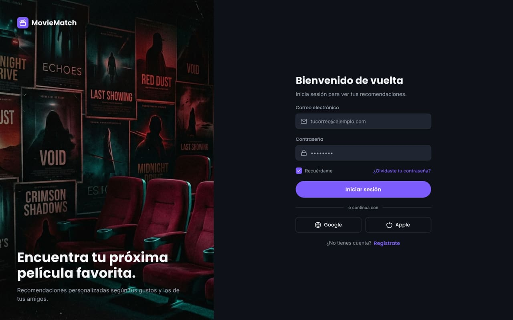</figure>

<figure class="shot"><figcaption>Registro (CU-01)</figcaption></figure>

<figure class="shot"><figcaption>Inicio con recomendaciones (CU-05)</figcaption>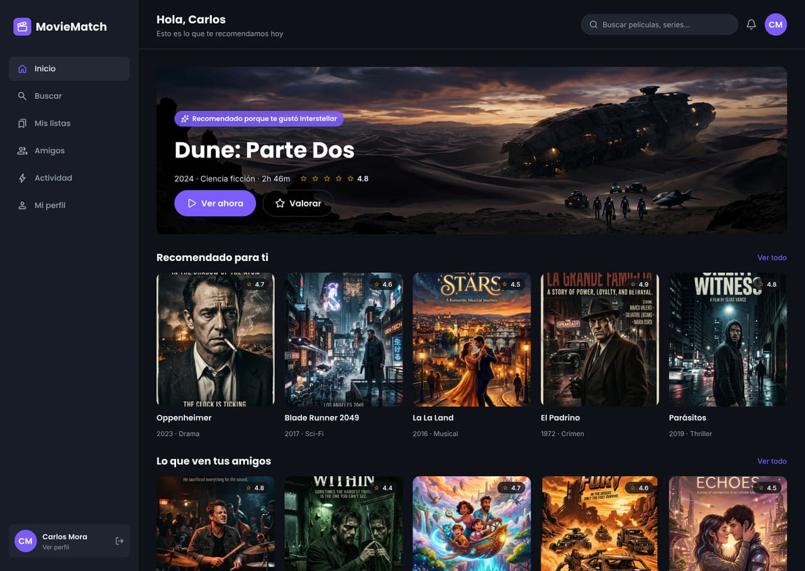</figure>

<figure class="shot"><figcaption>Detalle de película (CU-04 y CU-06)</figcaption>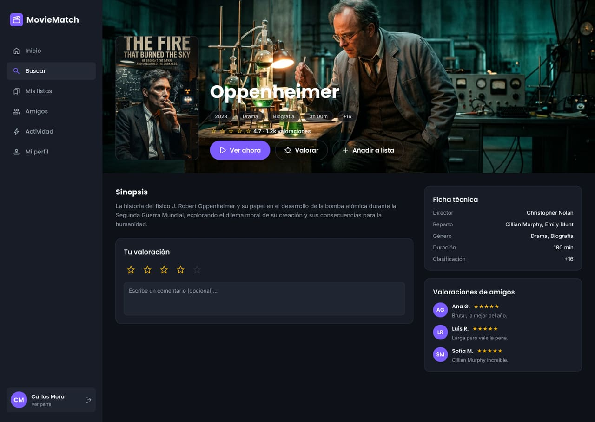</figure>

<figure class="shot"><figcaption>Catálogo y búsqueda (CU-06)</figcaption>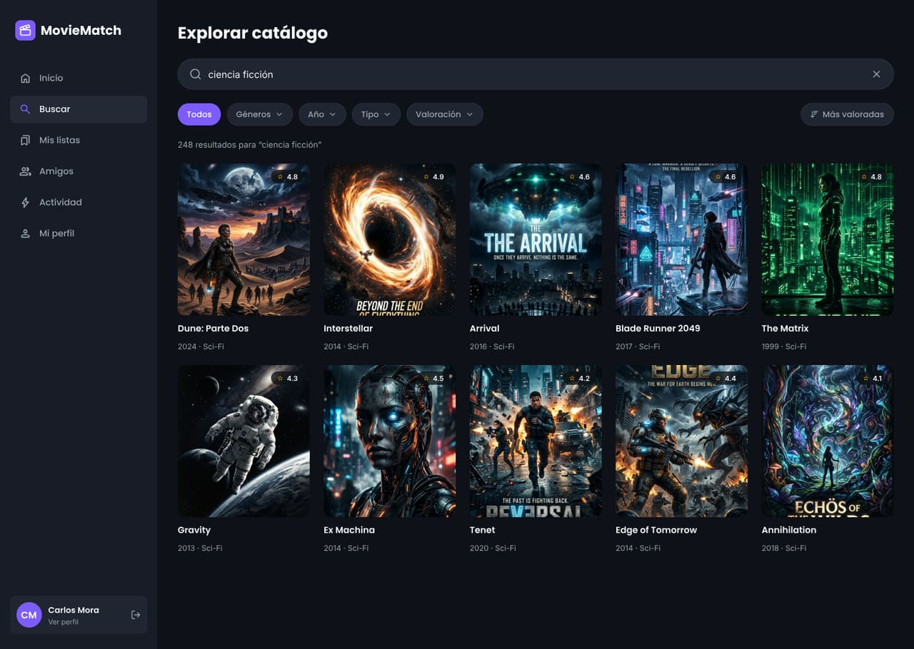</figure>

<figure class="shot"><figcaption>Perfil y preferencias (CU-03)</figcaption>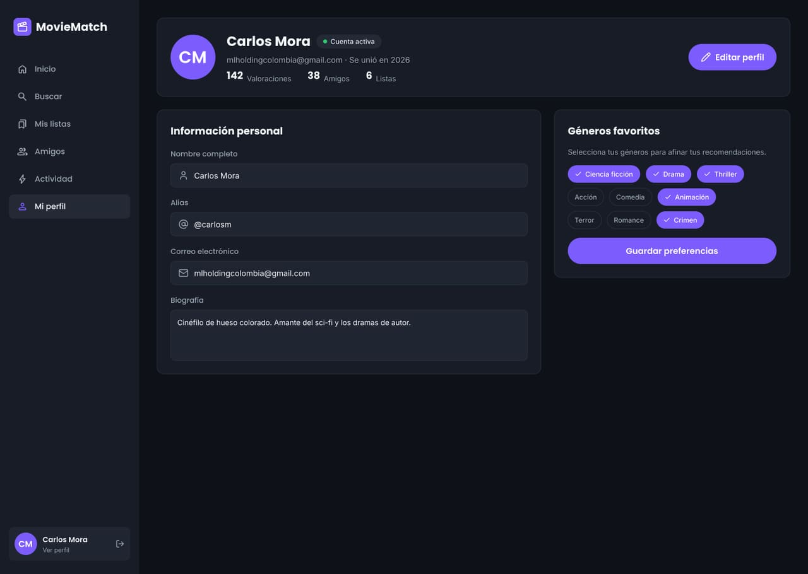</figure>

<figure class="shot"><figcaption>Amigos (CU-07)</figcaption>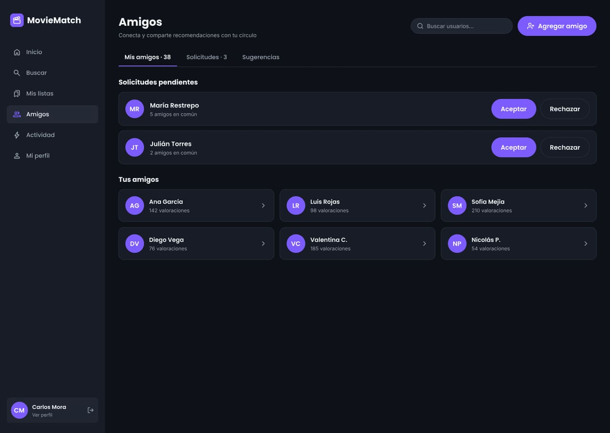</figure>

<figure class="shot"><figcaption>Mis listas (CU-08)</figcaption>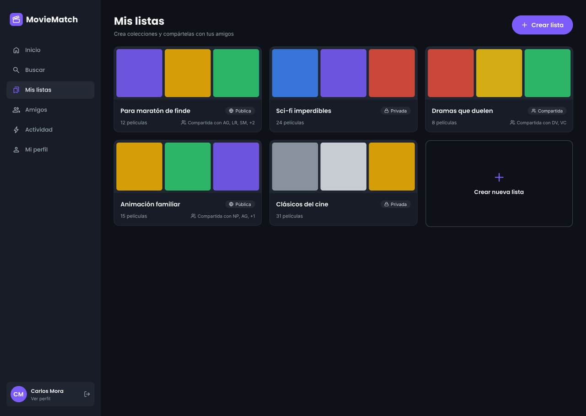</figure>

<figure class="shot"><figcaption>Actividad de amigos (CU-09)</figcaption>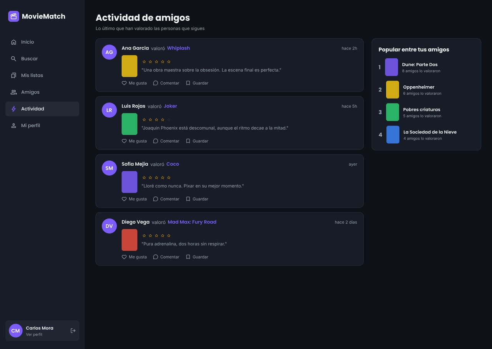</figure>

<figure class="shot"><figcaption>Panel de administración: métricas (CU-12)</figcaption>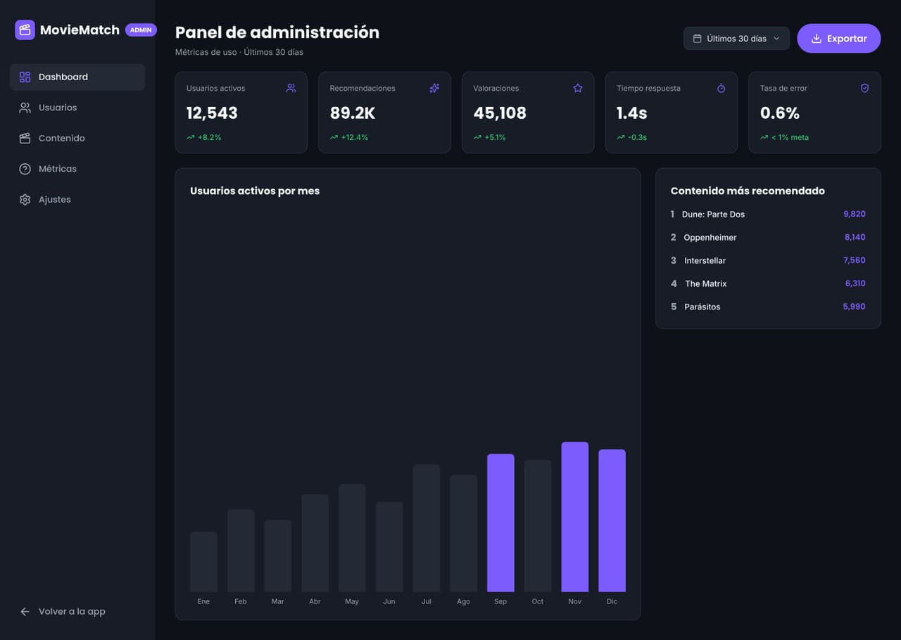</figure>

<figure class="shot"><figcaption>Panel de administración: usuarios (CU-10)</figcaption>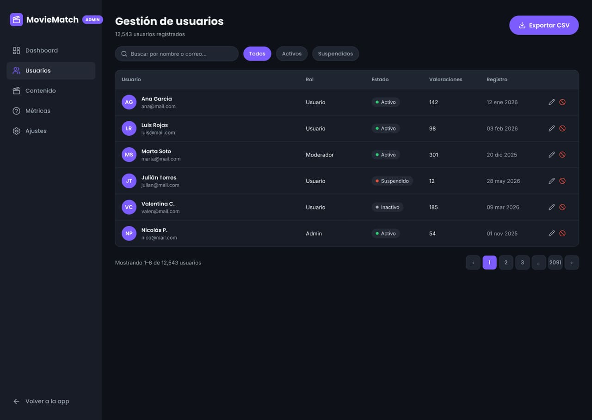</figure>

<figure class="shot"><figcaption>Panel de administración: contenido (CU-11)</figcaption>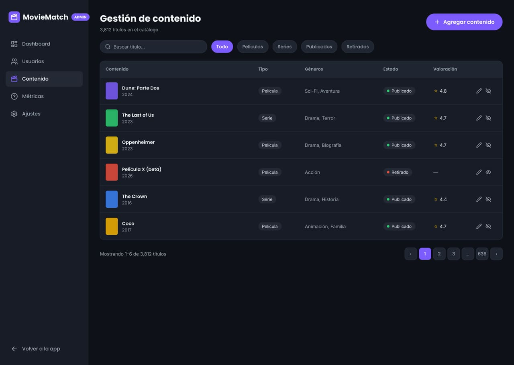</figure>
