# MovieMatch

## Diseño del sistema con metodología ICONIX

**Segundo entregable**

Asignatura: Calidad de Software 2025-2 
Profesor: Albeiro Espinosa Bedoya, Ph.D., M.Sc.

Estudiante: Mariana Agudelo Ospina (Equipo 1)

**Despliegue de la aplicación:** https://maagudeloo.pythonanywhere.com 
**Repositorio en GitHub:** https://github.com/Dev-Mao/moviematch

## Contenido

1. Metodología ICONIX
2. Modelo de dominio
3. Modelo de casos de uso
4. Diagramas de robustez
5. Diagramas de secuencia
6. Diagrama de clases
7. Modelo entidad-relación
8. Patrones de diseño

## 1. Metodología ICONIX

ICONIX es un proceso de desarrollo dirigido por casos de uso que enlaza los
requisitos con el código a través de una cadena de artefactos con trazabilidad
fuerte. Su recorrido va del modelo de dominio a las clases de implementación
pasando por el análisis de robustez y el diseño detallado con diagramas de
secuencia.

En este proyecto el recorrido fue el siguiente:

| Fase de ICONIX | Artefacto | Sección |
|---|---|---|
| Requisitos | Modelo de dominio | 2 |
| Requisitos | Casos de uso y prototipos de interfaz | 3 |
| Análisis y diseño preliminar | Diagramas de robustez | 4 |
| Diseño detallado | Diagramas de secuencia | 5 |
| Diseño | Diagrama de clases | 6 |
| Implementación | Modelo entidad-relación | 7 |

Todos los diagramas de diseño (robustez, secuencia, clases y entidad-relación)
se derivaron del código real de la aplicación construida en Django, de modo que
la documentación refleja exactamente lo que hace el sistema.

## 2. Modelo de dominio

El modelo de dominio fija el vocabulario del negocio: las entidades, sus
atributos y sus relaciones.

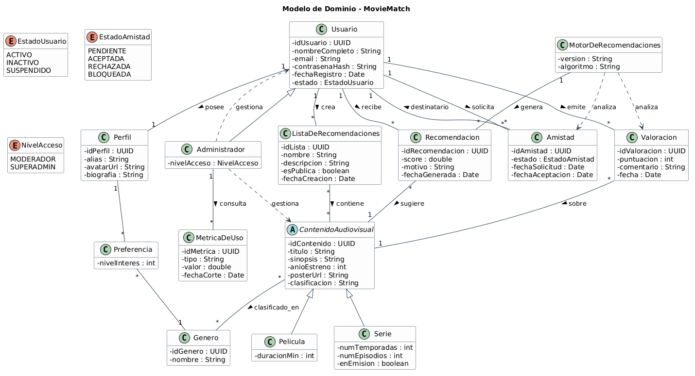

## 3. Modelo de casos de uso

El sistema tiene tres actores (usuario, administrador y el motor de
recomendaciones) y doce casos de uso.

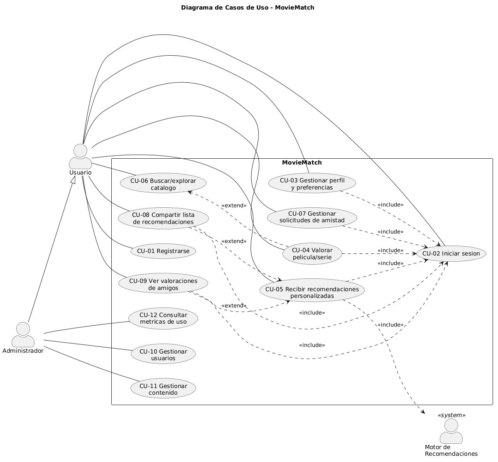

Para el diseño detallado con ICONIX se seleccionaron cinco casos de uso
representativos, que en conjunto ejercitan todas las capas de la aplicación y las
reglas de negocio más importantes: CU-01 Registrarse, CU-02 Iniciar sesión, CU-04
Valorar película o serie, CU-05 Recibir recomendaciones personalizadas y CU-07
Gestionar solicitudes de amistad.

## 4. Diagramas de robustez

El diagrama de robustez es el artefacto característico de ICONIX. Clasifica los
objetos en tres tipos (frontera, control y entidad) y sirve de puente entre el
qué de los casos de uso y el cómo del diseño. Las pantallas son objetos de
frontera, las vistas y servicios son objetos de control, y los modelos son
objetos de entidad.

### CU-01 Registrarse

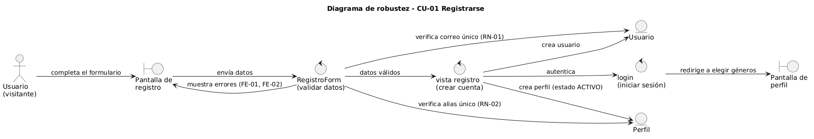

### CU-02 Iniciar sesión

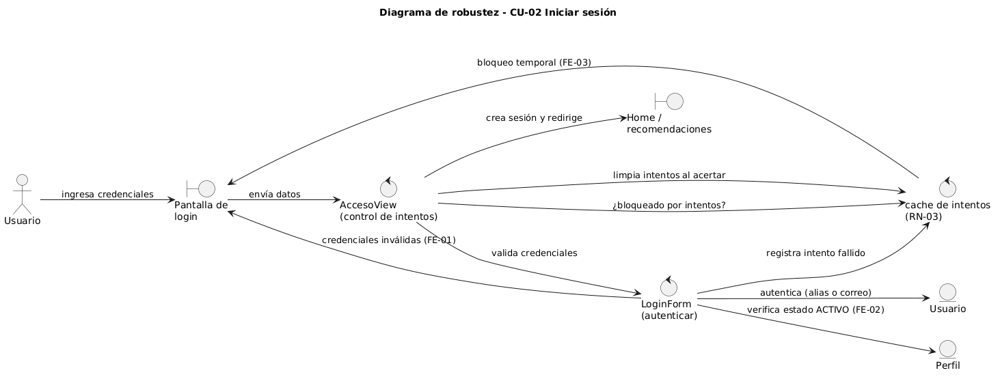

### CU-04 Valorar película o serie

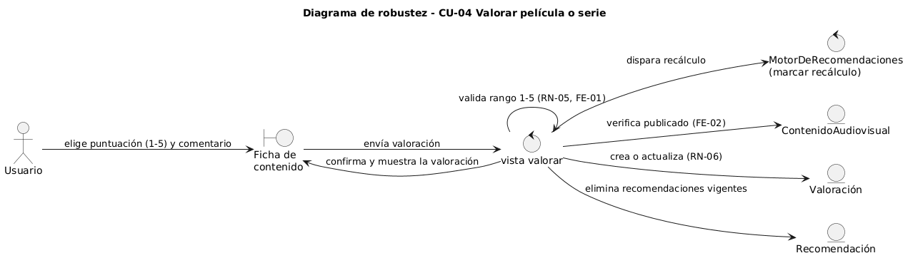

### CU-05 Recibir recomendaciones personalizadas

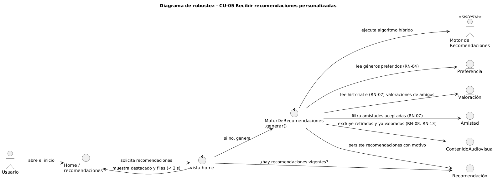

### CU-07 Gestionar solicitudes de amistad

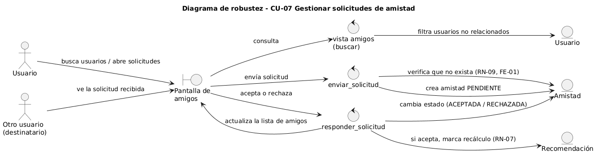

## 5. Diagramas de secuencia

Los diagramas de secuencia detallan, mensaje a mensaje, cómo colaboran los
objetos para realizar cada caso de uso. Corresponden al diseño detallado de
ICONIX y en ellos aparecen los métodos reales de las clases.

### CU-01 Registrarse

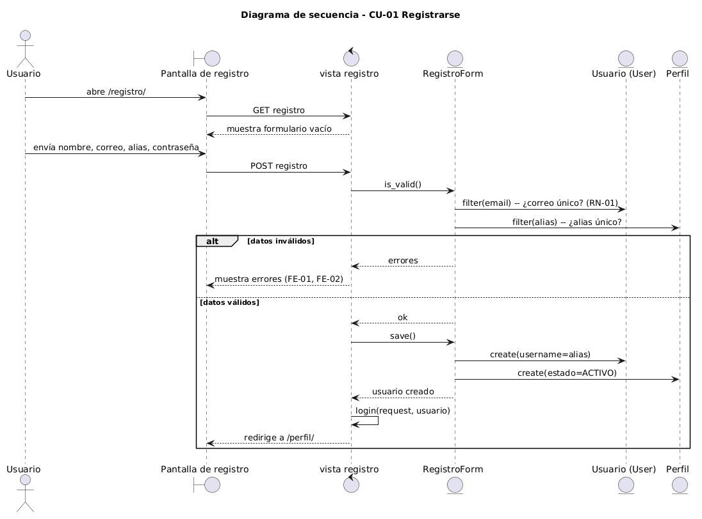

### CU-02 Iniciar sesión

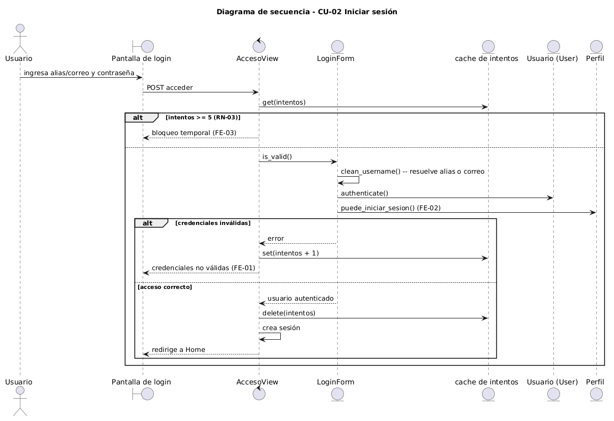

### CU-04 Valorar película o serie

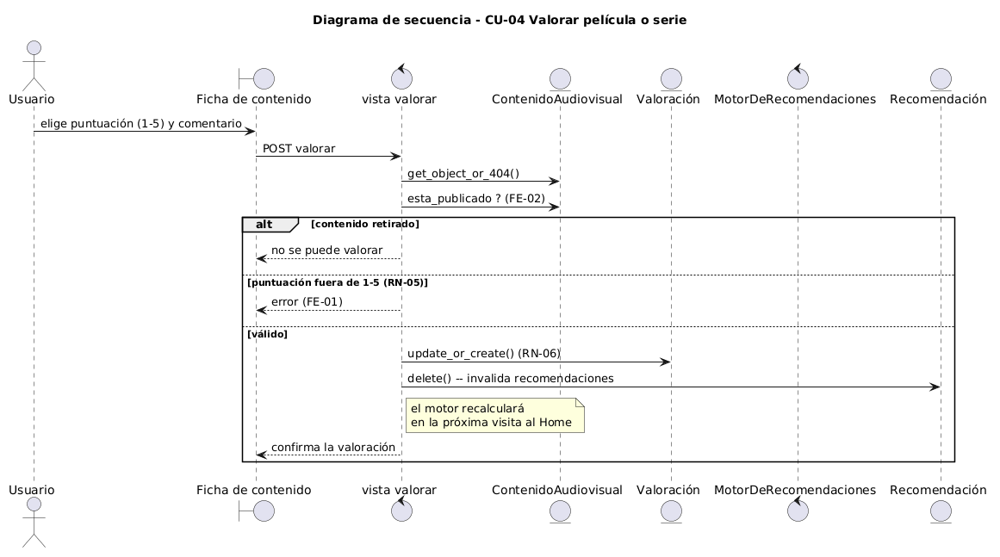

### CU-05 Recibir recomendaciones personalizadas

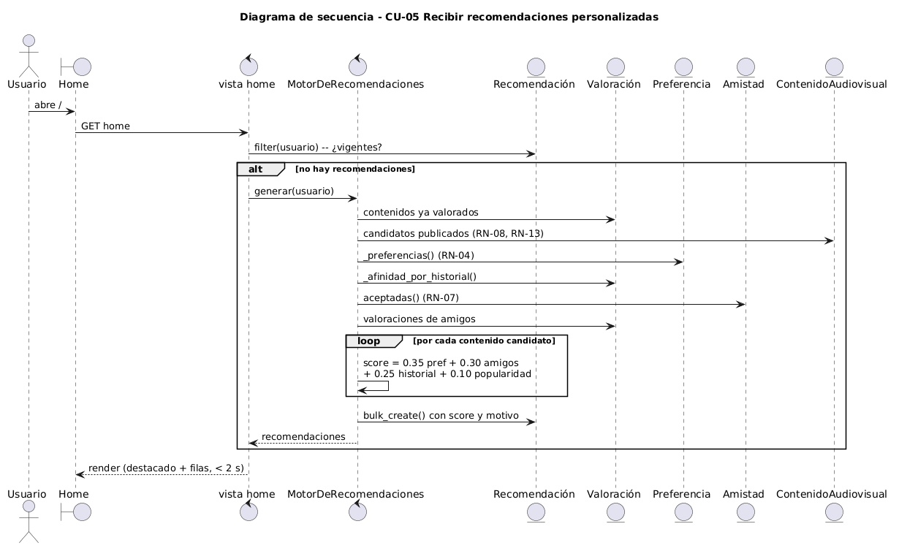

### CU-07 Gestionar solicitudes de amistad

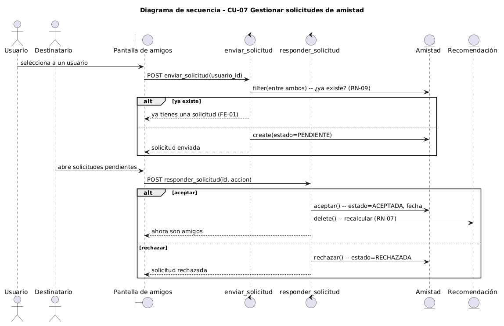

## 6. Diagrama de clases

El diagrama de clases de diseño muestra la estructura estática de la
implementación, organizada por módulos, con los atributos, los métodos y las
relaciones reales del código. Se distinguen las clases de servicio (el motor de
recomendaciones), los gestores de consultas y las enumeraciones.

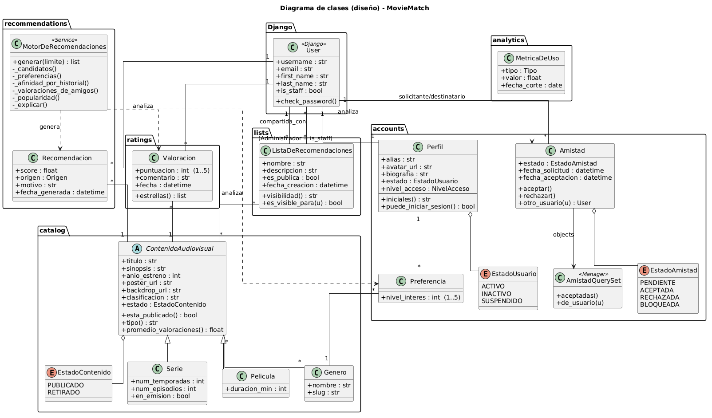

## 7. Modelo entidad-relación

El modelo entidad-relación corresponde al esquema físico de la base de datos
SQLite generado por el mapeador objeto-relacional de Django. Incluye las tablas
intermedias de las relaciones muchos a muchos y la herencia multi-tabla de
películas y series sobre el contenido audiovisual.

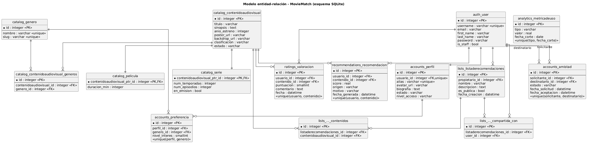

## 8. Patrones de diseño

El diseño aplica varios patrones reconocidos. En lugar de forzar patrones
artificiales, se documentan los que surgieron de forma natural en la solución.

### Patrón de arquitectura: MTV (Modelo–Plantilla–Vista)

La aplicación sigue el patrón arquitectónico de Django, una variante del clásico
Modelo–Vista–Controlador. Los modelos concentran los datos y las reglas de
negocio, las plantillas se encargan de la presentación y las vistas actúan como
controladores que orquestan la interacción. Esta separación es la que permite
que los diagramas de robustez distingan con claridad los objetos de entidad, de
frontera y de control.

### Strategy: el motor de recomendaciones

El motor de recomendaciones (`apps/recommendations/services.py`) combina cuatro
señales independientes para puntuar cada contenido: preferencias declaradas,
historial de valoraciones, valoraciones de amigos y popularidad. Cada señal se
calcula por separado y se pondera con un peso configurable. Agregar o cambiar una
estrategia de puntuación no obliga a reescribir el resto, lo que corresponde a la
intención del patrón Strategy: encapsular algoritmos intercambiables.

### Template Method y herencia: contenido audiovisual

`ContenidoAudiovisual` define la estructura y el comportamiento común (título,
sinopsis, estado, promedio de valoraciones) y delega en sus subclases `Película`
y `Serie` los atributos específicos, usando herencia multi-tabla. La clase base
fija el esqueleto y las subclases completan las diferencias, en la línea del
patrón Template Method.

### Repository / Manager: consultas de amistad

`AmistadQuerySet` (`apps/accounts/models.py`) encapsula las consultas del dominio
detrás de métodos con nombre propio, como `aceptadas()` y `de_usuario()`. El
resto del código pide amistades por intención y no por detalles de la consulta,
que es justamente el propósito del patrón Repository, aquí materializado con el
mecanismo de gestores de Django.

### Facade: fachada del subsistema de recomendaciones

La clase `MotorDeRecomendaciones` expone un único método público, `generar()`,
que oculta la complejidad interna (obtención de candidatos, cálculo de señales,
ponderación y persistencia). Las vistas interactúan con una interfaz simple sin
conocer el subsistema, que es la esencia del patrón Facade.

### Resumen de patrones

| Patrón | Dónde | Propósito |
|---|---|---|
| MTV | Toda la aplicación | Separar datos, presentación y control |
| Strategy | Motor de recomendaciones | Combinar señales de puntuación intercambiables |
| Template Method | Contenido audiovisual | Reutilizar el comportamiento común de películas y series |
| Repository / Manager | Consultas de amistad | Encapsular las consultas del dominio |
| Facade | Servicio de recomendaciones | Ofrecer una interfaz simple a un subsistema complejo |
